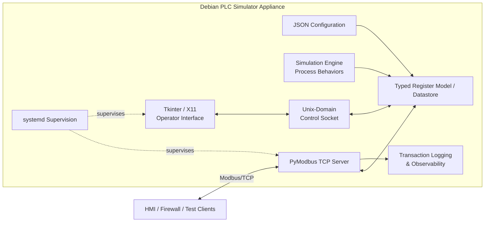

# Modbus PLC Simulator — Portfolio Case Study

A reusable Modbus/TCP simulation appliance designed for industrial automation, HMI validation, and OT/ICS cybersecurity testing without requiring continuous access to production PLC hardware.

> **Public portfolio edition:** This repository is a sanitized engineering case study. Proprietary source code, production-derived register maps, company branding, internal network configuration, deployment scripts, credentials, device identifiers, and customer/employer-specific information are intentionally excluded.

## Project Summary

I designed and developed an appliance-style Modbus/TCP simulator to provide a repeatable test endpoint for industrial software and security validation. The system models a representative PLC register space, supports controlled process-value behaviors, exposes Modbus/TCP to external test clients, and provides a local operator interface for test control and observability.

The project addressed a practical engineering problem: testing firewalls, HMIs, and industrial integrations against realistic Modbus behavior without depending on production PLC availability.

## Problem

Industrial test environments often face several constraints:

- Production PLCs may not be continuously available for bench testing.
- Generic Modbus tools may not reproduce the register structure or behavior needed for realistic validation.
- Security testing requires a server that accepts normal protocol operations so enforcement can be validated independently.
- Testers need repeatable dynamic values, fault conditions, counters, ramps, and other process-like signals.
- Protocol evidence must distinguish external network requests from internal GUI activity.
- The environment should survive reboot and be reproducible without rebuilding the test bench manually.

## Solution

I built a Python-based Modbus/TCP simulator around a typed register model, configurable simulation engine, and lightweight local operator interface.

The public edition describes the architecture and engineering approach using synthetic examples only. The original implementation used an employer-specific register definition and deployment environment; those materials are not included here.

### Core capabilities

- Configurable Modbus/TCP server
- Holding-register and coil simulation
- Manual/static values and dynamic behaviors
- Repeatable test scenarios
- Local operator interface
- External JSON-based view and scenario definitions
- Modbus transaction monitoring
- Separation of internal control-plane activity from external protocol traffic
- Service supervision and appliance-style startup
- Reproducible deployment and validation workflow

## Architecture



The architecture separates three primary concerns:

- **Register definition** — the PLC register model and datastore
- **Simulation behavior** — controlled changes to simulated process values
- **Protocol access** — external Modbus/TCP clients interacting with the simulated PLC

The operator interface communicates with the running simulator through a local
Unix-domain control socket rather than exposing another network service.

Transaction logging is focused on genuine Modbus/TCP client activity so that
internal GUI inspection and control operations do not pollute protocol-level
observability.

## Simulation Behaviors

The value engine supports representative process behaviors such as:

- Static/manual values
- Increment/decrement
- Counters
- Toggle states
- Ramps
- Sawtooth patterns
- Randomized values
- Sine-wave values
- Clock/time-derived values

These behaviors can be combined into repeatable scenarios to reproduce equipment states without modifying application code.

## Observability

One important engineering challenge was ensuring that internal GUI polling did not appear as external Modbus traffic.

The architecture separates local control-plane access from wire-side protocol activity so transaction monitoring represents genuine Modbus/TCP requests received from external clients. Validation used packet capture and socket inspection to confirm the distinction.

## External Definition System

Views and scenarios can be represented as JSON definitions validated against schemas. This allows test configurations to be created outside the GUI and imported into the running appliance.

For the public portfolio edition, only synthetic examples should be used. Production tag names, addresses, register maps, device names, and process terminology are intentionally excluded.

Example concept:

```json
{
  "name": "Demo Process View",
  "points": [
    "DEMO_PRESSURE",
    "DEMO_TEMPERATURE",
    "DEMO_RUN_STATE"
  ]
}
```

## Deployment Engineering

The original project was engineered as a Linux appliance rather than a collection of ad-hoc scripts. Engineering concerns included:

- Minimal operating-system footprint
- Python virtual-environment management
- Pinned dependencies
- Service supervision
- Automatic local UI startup
- Persistent configuration and project data
- Upgrade-safe backups
- Network validation
- Least-privilege service execution
- Repeatable installation and validation

Exact production deployment scripts and network settings are intentionally not published.

## Validation Approach

Testing focused on repeatability and separation of concerns. Representative validation included:

- External Modbus read/write behavior
- Register and coil access
- Dynamic scenario behavior
- Manual overrides
- Transaction logging
- Distinguishing internal UI access from network requests
- Service recovery after reboot
- Configuration persistence
- Network/socket verification
- Packet-capture correlation

## Technologies Demonstrated

**Industrial / OT**  
Modbus/TCP · PLC addressing · Holding registers · Coils · HMI test workflows · OT/ICS test-bench design

**Software**  
Python · PyModbus · Tkinter · JSON · JSON Schema · Asynchronous programming · Data modeling · Application architecture

**Linux**  
Debian · systemd · Bash · X11/Openbox · Python virtual environments · Linux capabilities · Service supervision

**Networking**  
TCP/IP · Static addressing · Routing · Packet capture · Socket inspection · Multi-interface appliance design

**Engineering Practices**  
Reproducible deployment · Validation scripts · Backups · Configuration separation · Runtime observability · Troubleshooting · Documentation · Iterative integration testing

## AI-Assisted Engineering

AI tools were used as an engineering assistant during portions of troubleshooting, scaffolding, test planning, command generation, and documentation. AI-generated suggestions were reviewed by the engineer, applied incrementally, and validated against actual system behavior rather than deployed without verification.

## What Is Intentionally Not Public

This portfolio repository does **not** contain:

- Employer or customer names and branding
- Original company repository history
- Proprietary source code
- Production-derived PLC tag/register exports
- Real tag names or process terminology
- Exact production IP addresses or routes
- Internal hostnames, domains, usernames, or email addresses
- Credentials, keys, tokens, certificates, or secrets
- Device serial numbers, MAC addresses, or unique identifiers
- Production deployment scripts or service configuration
- Internal manuals or screenshots containing company information

## Repository Purpose

This repository documents the engineering problem, architecture, design decisions, validation approach, and technologies demonstrated by the project while keeping the underlying employer-owned implementation private.

It is intended as a professional portfolio case study, not as a distributable copy of the production system.

## Disclaimer

This is a sanitized portfolio description of work performed in a professional environment. Names, identifiers, network details, register definitions, data, and implementation-specific details have been generalized or omitted. No employer or customer source code or confidential configuration is distributed in this repository.
