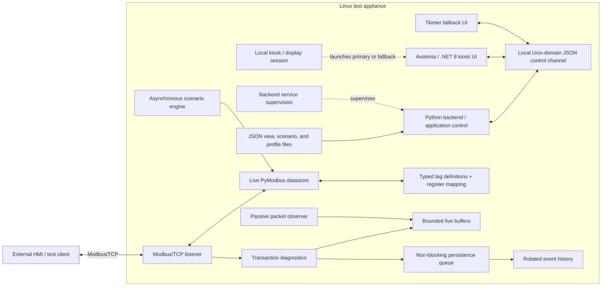
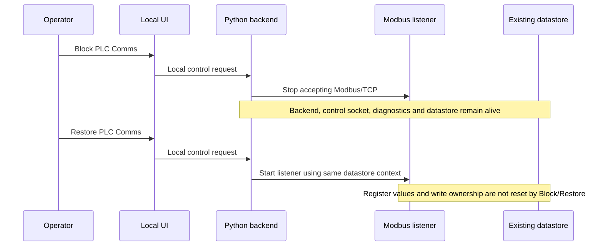

# Architecture | Public Engineering Notes

This document describes logical boundaries verified against the private `2.0.0-preview.4` source snapshot. Names, paths, network settings, real tag data, and deployment particulars have been generalized for public use. It is not an installation guide or a source-code substitute.

## Design goals

1. Keep real Modbus/TCP operations separate from local UI/control requests.
2. Reuse a typed register map and *live datastore* across external clients, internal simulation, and operator intervention.
3. Change simulated process behavior through validated file-based definitions instead of changing server code.
4. Allow intentional Modbus service interruption without terminating the backend control plane or resetting the register state.
5. Keep UI refresh, passive observation, and disk persistence outside the protocol response path.
6. Make failures, evidence retention limits, and device-test assumptions explicit.

## Component diagram

The UI and fallback are **alternatives**, not simultaneously required applications. The passive packet observer watches the network interface independently of the server's decoded transaction records. The diagram is a conceptual design; it does not prescribe a public installable topology.

## Data plane: external protocol requests

An external client connects to the Modbus/TCP listener. The server checks the mapped address space, reads or writes the shared live datastore, and returns a Modbus response or exception as appropriate. The model distinguishes zero-based PDU addresses from human-readable reference addresses and handles multiword values with configured word ordering. Transaction observability is attached to this external-protocol path, not to a GUI's normal local status read.

A **confirmed accepted** external write can claim configured writable scenario tags after the datastore commit. A rejected/failed write must not claim ownership merely because a write was attempted. A new scenario or explicit tag reconfiguration can reassign those updates. The mechanism is intended to keep a periodic scenario from immediately overwriting an accepted client command.

## Control plane: local operator actions

The operator interface uses a local Unix-domain JSON socket to request status, inspect tag values, apply/clear scenarios, set manual values, change communication availability, and obtain diagnostic snapshots. The frontend is outside the Modbus request/response path. It can also read/write supported local JSON definitions; runtime effects occur when the backend loads or applies them.

The primary UI is Avalonia/.NET 8. A Tkinter UI remains available as a startup fallback if the Avalonia executable cannot be launched. The backend is supervised independently of the local kiosk session; the previous case-study diagram incorrectly implied that one systemd service supervises both the Modbus backend and the GUI.

## Simulation behavior and initial state

The simulation engine is separate from the transport and operates through an adapter to the live datastore. A view names a set of existing model tags. A scenario associates one view with configured tag behaviors, while omitted view tags can appear in the editor with manual defaults. The full engine includes manual, static, increment/decrement, wrap/counter, toggle, ramp, saw, random, sine, and clock modes; the UI's mode selector exposes the commonly used subset.

`manual` is a **no-periodic-write mode**, not an instruction to write the JSON `value` at scenario start. Initial values come from the loaded catalog when creating the datastore or from an explicit value-setting operation. A live manual override changes the runtime value/mode without modifying the saved scenario definition.

Saved traffic views have a different purpose: they are named multi-tag **filters over already observed transactions**. They do not request register reads, execute simulation, or write datastore values. Edited traffic-view files can be detected while Live Traffic is open.

## Communication-block and restore sequence

This simulates a **listener outage**, not appliance power failure, a network cable fault, or an HMI-specific error state. A reboot/process restart is a distinct test with separate persistence expectations; the live datastore is not described as disk-persistent across a backend restart.

## Evidence planes and retention

| Plane | Source and use | Retention / limitation |
| --- | --- | --- |
| Decoded transactions | Server handling of external Modbus requests | Bounded live RAM; meaningful write and exception records can be queued for history. |
| Passive packets | Network-interface capture of relevant Modbus/TCP traffic | Bounded live RAM; capture can be unavailable or incomplete due to permissions, interface visibility, or drops. |
| Internal value changes | Scenario execution or explicit local manual intervention | Labeled as internal changes; routine high-rate updates are not external requests. |
| Event history | Asynchronous persistence queue for selected events and periodic summaries | Rotated files with free-space safeguards; queue overflow or disk errors can reduce retained evidence. |
| UI live display | Polling and filtering of current diagnostic buffers | Latest 18 matching transaction rows / 30 packet rows are visible, not the full buffer or a complete historical packet trace. |

Event-oriented history is searchable across retained rotated files. CSV/JSON/PCAP export operates on available live-buffer data; do not describe such a file as a complete historical capture. Persisting an observation is deliberately decoupled from deciding a Modbus response.

## Publication boundary and operational limits

Only general component and behavior descriptions are public. The private system's original data maps, source files, network bindings, privilege settings, service units, package artifacts, proprietary examples, and captured traffic are excluded. This simulator is a controlled test instrument and cannot establish the behavior, safety, or security of a production PLC or a particular HMI without separate external tests.

See [Validation and limitations](VALIDATION.md) for the difference between source-visible behavior and run-time acceptance evidence.
